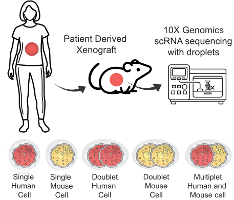
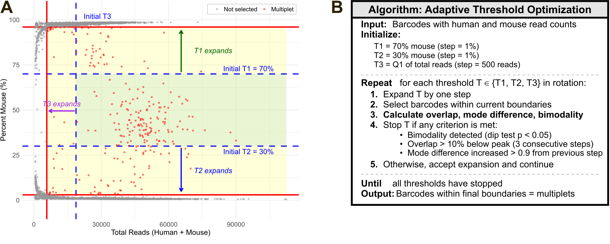

<!-- README.md is generated from README.Rmd. Please edit that file and knit with devtools::build_readme() -->

```{r setup, include = FALSE}
knitr::opts_chunk$set(
  collapse = TRUE,
  comment = "#>",
  fig.path = "man/figures/README-",
  fig.width = 10,
  fig.height = 4,
  out.width = "100%"
)
```

# multipletR

Adaptive detection of human-mouse multiplets in patient-derived xenograft (PDX)
single-cell RNA-seq data.

In mixed-species experiments (such as PDX models, where a human tumor grows in a
mouse host), some droplets capture both a human and a mouse cell. These
**multiplets** must be removed before downstream analysis. `multipletR` detects
them using an adaptive threshold method that, unlike fixed cutoffs, does **not**
assume a fixed human/mouse proportion, so it handles the imbalanced species
mixtures typical of real PDX samples.

## The problem

In a PDX sample, human tumor cells and mouse host cells are sequenced together,
and some droplets capture one of each: a human-mouse multiplet. Cell Ranger flags
multiplets with fixed read-count thresholds that assume a roughly balanced
human/mouse mix. In real PDX data the mix is rarely balanced, so cells that are
almost entirely human (or mouse) get mislabeled as multiplets.

<p align="center">

</p>

## The approach

Instead of fixed cutoffs, `multipletR` starts from a conservative central region
(cells with a genuinely balanced human/mouse mix) and expands three thresholds
step by step, stopping once the selected cells stop looking like real multiplets
(when their read distributions become bimodal, stop overlapping, or drift apart).
This lets the multiplet region adapt to each sample.

<p align="center">

</p>

## Installation

Install the released version as:

``` r
# install.packages("remotes")
remotes::install_github("dozmorovlab/multipletR")
```

For the latest development version, use:

``` r
remotes::install_github("Alex05a/multipletR")
```

The `remove_multiplets()` helper additionally requires either the `Seurat`
package or `SingleCellExperiment`, depending on which object type you use.

```{r load}
library(multipletR)
```

## The input: Cell Ranger's GEM classification file

The package takes a single file as its primary input: the GEM classification CSV
produced by Cell Ranger when reads are aligned to a combined two-species
reference. This section explains where that file comes from, where to find it,
and what it contains.

### How the data is generated

In droplet-based single-cell RNA-sequencing (10x Genomics Chromium), each
droplet (a GEM, Gel Bead-in-EMulsion) captures one or more cells together with a
barcoded gel bead, so every cell's transcripts inherit a shared cell barcode and
each molecule gets a unique molecular identifier (UMI). Most droplets contain a
single cell (a singlet), but some capture two or more; when those cells come from
different species, the droplet is a human-mouse multiplet.

To tell the two species apart, reads are aligned with `cellranger count`
against a combined ("barnyard") reference that contains both genomes, for example
GRCh38 (human) and GRCm39 (mouse). In this reference every gene is prefixed by
its genome of origin (e.g. `GRCh38-EPCAM`, `GRCm39-Col1a1`), so each read can be
attributed to human or mouse. For every cell barcode, Cell Ranger counts how
many reads map to each genome and, using fixed count thresholds, labels the
barcode as human, mouse, or a multiplet. This per-barcode, two-genome summary is
written to the GEM classification file.

### Where to find it

The file is written only when the reference is a multi-genome (barnyard)
reference. For a run with `--id=<SAMPLE>`, it is located at:

```
<SAMPLE>/outs/analysis/gem_classification.csv
```

The full expression matrix lives separately at
`<SAMPLE>/outs/filtered_feature_bc_matrix/`. `multipletR` does not need the
matrix, only `gem_classification.csv`, although the Seurat/SingleCellExperiment
helper later joins the calls back onto a matrix-derived object by barcode.

### What it contains

One row per cell barcode, with these columns:

| Column | Meaning |
|---|---|
| `barcode` | The 10x cell barcode (often carries a `-1` suffix, e.g. `AAACCTGAG...-1`). |
| *human genome* | Per-barcode count of reads assigned to the human genome, named after the reference build, e.g. `GRCh38`. |
| *mouse genome* | Per-barcode count of reads assigned to the mouse genome, named after the build: `GRCm39` (2024-A references), or `mm10` / `mm39` for older builds. |
| `call` | Cell Ranger's own classification: the human genome name (e.g. `GRCh38`), the mouse genome name (e.g. `GRCm39`), or `Multiplet`. |

A typical file looks like:

```
barcode,GRCh38,GRCm39,call
AAACCTGAGAAACCAT-1,10432,58,GRCh38
AAACCTGAGATCCGAG-1,71,9903,GRCm39
AAACCTGCACGTGTGA-1,4821,5210,Multiplet
```

The first row is dominated by human reads (a human singlet), the second by mouse
reads (a mouse singlet), and the third has substantial reads from both genomes (a
multiplet).

The package ships a real PDX example (sample PC65). Here are the first rows:

```{r peek-input}
gem_file <- system.file("extdata", "PC65_gem_classification.csv",
  package = "multipletR"
)
head(read.csv(gem_file))
```

### Why this is the input multipletR needs

The package's whole premise is that a true human-mouse multiplet has substantial
reads from both genomes, whereas a singlet is dominated by one. The GEM
classification file provides exactly the two numbers needed to test that: the
human and mouse read counts per barcode. From them, `multipletR` derives, for
each barcode, the total reads (human + mouse) and the percent mouse
(mouse / total x 100), and applies its adaptive thresholds in that
total-reads by percent-mouse space rather than trusting Cell Ranger's fixed
`call`. The `call` column is kept only for the comparison plots.

### Column-name flexibility

Because the genome columns are named after whichever reference build was used,
`multipletR` recognizes several common names automatically, so you do not have to
rename anything:

- **Human:** `GRCh38`, `hg38`, `human_reads`, `human`
- **Mouse:** `GRCm39`, `mm10`, `mm39`, `mouse_reads`, `mouse`
- **Barcode:** `barcode`, `Barcode`, `barcodes` (if none is present, the row index is used as a fallback)
- **Call:** `call`, `Call`, `classification`

As long as the file has a human read-count column and a mouse read-count column,
`detect_multiplets()` will run; the barcode and call columns are optional but
recommended (the barcode is what lets you match results back to a Seurat or
SingleCellExperiment object).

**Tip:** barcode suffixes must match between the GEM file and any object you
later filter. Cell Ranger writes barcodes with a trailing `-1`; if your object's
cell names lack it (or vice versa), `remove_multiplets()` will match nothing.
Make the two consistent before joining.

## Detecting multiplets

`detect_multiplets()` reads the GEM classification file, runs the adaptive
threshold engine, writes an annotated CSV, and (by default) draws diagnostic
plots. It returns the input data with three added columns: `our_classification`
(`Multiplet` / `Singlet`), `pct_human`, and `pct_mouse`.

Here we draw both diagnostic views: the percent plot (total reads vs percent
mouse) and the total-reads plot (mouse reads vs human reads).

```{r detect, fig.alt = "Diagnostic plots colored by 10X and by multipletR classification"}
res <- detect_multiplets(
  fileIn  = gem_file,
  fileOut = tempfile(fileext = ".csv"),
  plotPercent    = TRUE,
  plotTotalReads = TRUE
)
```

The one-line summary reports the final thresholds and the number of multiplets
found. The returned data frame carries the per-cell result:

```{r result}
head(res)
table(res$our_classification)
```

### Reading the diagnostic plots

Each plot has two panels: the left colored by Cell Ranger's `call`, the right by
the multipletR classification. Across both panels human singlets are blue and
mouse singlets are green; Cell Ranger's multiplets are orange (left) and
multipletR's are red (right), so it is easy to see which cells each method flags.

In the percent plot, multiplets sit in the central percent-mouse band, where a
droplet carries a real mix of human and mouse reads; pure human cells fall near
0% mouse and pure mouse cells near 100%. In the total-reads plot, true multiplets
have substantial reads from *both* genomes, so they sit away from the two axes.

The contrast with Cell Ranger is the key point. In this PDX sample Cell Ranger's
fixed thresholds label many predominantly single-species barcodes as multiplets,
whereas the adaptive method keeps only the balanced droplets. You can see the
size of that gap directly:

```{r compare-counts}
# Cell Ranger's multiplet calls (from the GEM file)
sum(read.csv(gem_file)$call == "Multiplet")
# multipletR's multiplet calls
sum(res$our_classification == "Multiplet")
```

We can confirm the multiplets multipletR keeps are genuinely balanced by looking
at their composition, which centers near a mixed human/mouse split rather than
sitting at one extreme:

```{r composition}
mult <- res[res$our_classification == "Multiplet", ]
summary(mult$pct_human)
summary(mult$pct_mouse)
```

### Adjusting the thresholds

The defaults are the recommended values and rarely need changing, but every
parameter is adjustable. The three starting thresholds are `T1` (upper percent
mouse), `T2` (lower percent mouse), and `T3` (lower total-reads percentile); the
two stopping sensitivities are `overlapDrop` and `modeDiff`. For example, a more
conservative run:

```{r adjust, eval = FALSE}
res_strict <- detect_multiplets(
  fileIn      = gem_file,
  fileOut     = tempfile(fileext = ".csv"),
  overlapDrop = 5, # stop expanding sooner
  modeDiff    = 0.5 # stricter on distribution similarity
)
```

See `?detect_multiplets` for the full list of arguments.

## Using the results with Seurat or SingleCellExperiment

Once multiplets are detected, `remove_multiplets()` carries the result onto a
single-cell object. It adds the per-cell classification to the object's cell
metadata (`multipletR_class`, `multipletR_pct_human`, `multipletR_pct_mouse`)
and, by default, removes the detected multiplets so the object is ready for
downstream analysis. Setting `remove = FALSE` keeps all cells and only annotates
them, which is useful for visualizing where the multiplets fall (for example on a
UMAP colored by `multipletR_class`) before deciding whether to filter, following
the same idea as tools like DoubletFinder.

Use `object = "seurat"` for a Seurat object or `object = "sce"` for a
`SingleCellExperiment`; the classification logic is identical, only the metadata
is written to the appropriate slot.

``` r
library(Seurat)
# Build a Seurat object from the same sample's count matrix, then:
# Annotate only (keep all cells) to inspect the multiplets first
seu <- remove_multiplets(seu, res, object = "seurat", remove = FALSE)
table(seu$multipletR_class)
DimPlot(seu, group.by = "multipletR_class")
# Or annotate and remove in one step, ready for downstream analysis
seu_clean <- remove_multiplets(seu, res, object = "seurat")
```

The same call works for a `SingleCellExperiment`:

``` r
library(SingleCellExperiment)
# With an existing SingleCellExperiment 'sce' whose colnames are barcodes:
sce <- remove_multiplets(sce, res, object = "sce", remove = FALSE)
table(sce$multipletR_class)
# Or annotate and remove in one step
sce_clean <- remove_multiplets(sce, res, object = "sce")
```

The object steps are shown but not run here, since they need the full count
matrix rather than just the GEM classification file.

## Functions

| Function | Purpose |
|------------------------------------|------------------------------------|
| `detect_multiplets()` | Detect multiplets from a Cell Ranger GEM classification file; add the classification and draw diagnostic plots. |
| `remove_multiplets()` | Annotate a Seurat or SingleCellExperiment object with the classification (Human / Mouse / Multiplet and percent human/mouse) and, by default, remove the multiplets. Set `remove = FALSE` to annotate only. |

## How it works

The method defines a conservative starting region using three thresholds: T1
(upper percent mouse), T2 (lower percent mouse), and T3 (lower total reads), then
expands them step by step to capture additional multiplets. It stops expanding
when the human and mouse read distributions start to look like singlets: when a
distribution becomes bimodal, when their overlap drops, or when their modes
diverge. This lets the multiplet region adapt to each dataset rather than relying
on a fixed cutoff.
